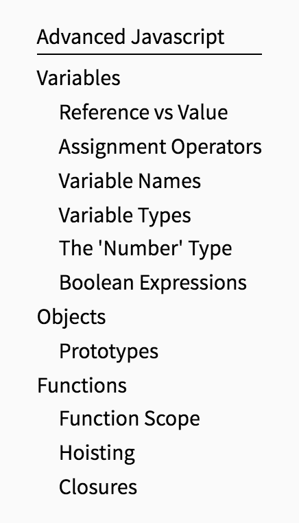

# Clutter for Pico

My notetaking theme for Pico CMS. Shamelessly ripped off from ['Bits and Pieces' by lostkeys](https://github.com/lostkeys/Bits-and-Pieces-Theme-for-Pico). I didn't copy any code, though - I had just been taking Markdown notes for a long time, and when I found Bits and Pieces, I thought it was a great idea. I decided to remake it my way as a fun exercise, and added my own features in the process.

You need to install the helper plugin as well, otherwise the theme will not work. It is contained in the `plugins/` directory. I chose to use a helper plugin rather than Javascript because it's a bit easier when reading through the HTML.

You can find a live version of this theme on my [knowledge base](http://docs.alanluo.com/), which the live version of my personal notebook for educational purposes.

## Features

**Nested Notes**


**Automatic Table of Contents**



**Keyboard Shortcuts**

Hard to show this in GIF form, but if you check out the [live version](http://docs.alanluo.com) you can hit `command + k` or `ctrl + k` to go straight to the ES6 page.

**MathJax Support**

Both inline and block typesetting support!

## Documentation

**Basic Usage**

You can nest directories indefinitely. Just make sure that whenever you create a new one, you also make a `index.md`. For instance, a file structure might look like:

```
index.md
404.md
Javascript/
	index.md
	Advanced Javascript/
		index.md
		Prototypes.md
		Functions.md
	ES6.md
```

**Shortcuts**

Sample metas:

```
---
Title: ES6
Description: Page about ES6
Shortcut: 'command+k,ctrl+k'
---

---
Title: Functions
Description: Page about Functions
Shortcut: 'command+g'
---
```

Shortcuts are bound using [Mousetrap](https://craig.is/killing/mice), with single-comma delimiters for multiple shortcuts. The `Shortcut` meta attribute is entirely optional.

**MathJax**

Because Pico renders before MathJax, wrap your typeset code in code tags (\` \`) to indicate preformatted text. This way underscores (`_`) won't get read as italics rather than subscript.

```
~~~~Inline Typesetting~~~~
`$V_{out}$`


~~~~Block Typesetting~~~~~
`$$V_{out} = V_{in} * \frac{R_2}{R_1+R_2}$$`

```